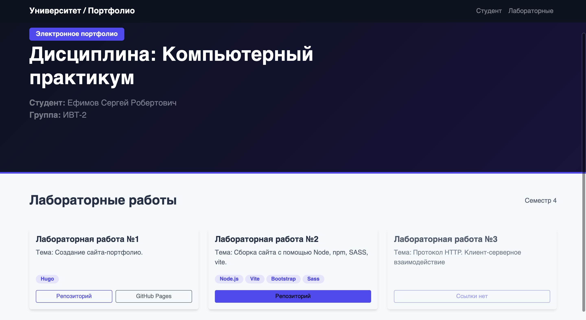

# Лабораторная работа 2. Сборка сайта с помощью node, Vite, SASS, Bootstrap.
## Постановка задачи
1. Изучите материалы, представленные в блоке материалов Сборка сайта с помощью Node, npm, yarn, SASS, vite. 
2. Используя один из подходов (vite / рекомендуется, webpack, nose-sass) приведите пример создания собственного кастомного дизайна сайта (на примере сайта-портфолио) с использованием Bootstrap или Bulma (или другого фреймворка, например, Tailwind).
3. Создайте отчет в виде текстового документа с использованием скриншотов или скринкаста, продемонстрируйте  результаты выполнения.
## Используемые технологии
- node.js
- Vite
- SASS
- Bootstrap
## Ход работы
### Создание проекта
```bash
npm create vite@latest
npm install
```
### Подключение SASS
```bash
npm install sass
```
Также был создан файл styles.scss, в который будут записаны стили.
### Подключение Bootstrap
```bash
npm install bootstrap
```
## Реализация сайта
### index.html
```html
<!DOCTYPE html>
<html lang="ru">
<head>
  <meta charset="UTF-8">
  <meta name="viewport" content="width=device-width, initial-scale=1.0">
  <title>Учебное портфолио по дисциплине</title>
</head>
<body>

  <nav class="navbar navbar-expand-lg navbar-dark bg-dark sticky-top">
    <div class="container">
      <a class="navbar-brand fw-bold" href="#">Университет / Портфолио</a>
      <button class="navbar-toggler" type="button" data-bs-toggle="collapse" data-bs-target="#navbarNav">
        <span class="navbar-toggler-icon"></span>
      </button>
      <div class="collapse navbar-collapse" id="navbarNav">
        <ul class="navbar-nav ms-auto">
          <li class="nav-item"><a class="nav-link" href="#student">Студент</a></li>
          <li class="nav-item"><a class="nav-link" href="#labs">Лабораторные</a></li>
        </ul>
      </div>
    </div>
  </nav>

  <header id="student" class="hero-section text-center text-md-start">
    <div class="container">
      <div class="row align-items-center">
        <div class="col-md-8">
          <span class="badge bg-primary mb-2 px-3 py-2 fs-6">Электронное портфолио</span>
          <h1 class="display-5 fw-bold mb-3">Дисциплина: Компьютерный практикум</h1>
          
          <ul class="list-unstyled text-white-50 fs-5 mb-4">
            <li><strong>Студент:</strong> Ефимов Сергей Робертович</li>
            <li><strong>Группа:</strong> ИВТ-2</li>
          </ul>
        </div>
      </div>
    </div>
  </header>

  <section id="labs" class="py-5">
    <div class="container">
      <div class="d-flex justify-content-between align-items-center mb-5">
        <h2 class="fw-bold m-0">Лабораторные работы</h2>
        <span class="text-muted">Семестр 4</span>
      </div>
      
      <div class="row g-4">
        
        <div class="col-md-4">
          <div class="card h-100 portfolio-card">
            <div class="card-body d-flex flex-column">
              <h5 class="card-title fw-bold">Лабораторная работа №1</h5>
              <p class="card-text text-muted flex-grow-1">Тема: Создание сайта-портфолио.</p>
              <div class="mb-3">
                <span class="tech-tag">Hugo</span>
              </div>
              <div class="d-grid gap-2 d-flex">
                <a href="https://github.com/yasnoponyal17/web-portfolio" target="_blank" class="btn btn-sm btn-outline-primary flex-fill">Репозиторий</a>
                <a href="https://yasnoponyal17.github.io/web-portfolio/" target="_blank" class="btn btn-sm btn-outline-secondary flex-fill">GitHub Pages</a>
              </div>
            </div>
          </div>
        </div>

        <div class="col-md-4">
          <div class="card h-100 portfolio-card border-primary" style="border-width: 2px;">
            <div class="card-body d-flex flex-column">
              <h5 class="card-title fw-bold">Лабораторная работа №2</h5>
              <p class="card-text text-muted flex-grow-1">Тема: Сборка сайта с помощью Node, npm, SASS, vite.</p>
              <div class="mb-3">
                <span class="tech-tag">Node.js</span>
                <span class="tech-tag">Vite</span>
                <span class="tech-tag">Bootstrap</span>
                <span class="tech-tag">Sass</span>
              </div>
              <div class="d-grid gap-2 d-flex">
                <a href="https://github.com/yasnoponyal17/site-build-lr2/tree/main/portfolio-lr2" target="_blank" class="btn btn-sm btn-primary flex-fill">Репозиторий</a>
              </div>
            </div>
          </div>
        </div>

        <div class="col-md-4">
          <div class="card h-100 portfolio-card opacity-75">
            <div class="card-body d-flex flex-column">
              <h5 class="card-title fw-bold">Лабораторная работа №3</h5>
              <p class="card-text text-muted flex-grow-1">Тема: Протокол HTTP. Клиент-серверное взаимодействие</p>
              <div class="mb-3">
              </div>
              <div class="d-grid gap-2 d-flex">
                <a href="#" class="btn btn-sm btn-outline-primary disabled flex-fill">Ссылки нет</a>
              </div>
            </div>
          </div>
        </div>

      </div>
    </div>
  </section>

  <script type="module" src="/src/main.js"></script>
</body>
</html>
```

### styles.scss
```scss
$primary: #6366f1;  
$success: #10b981;       
$dark: #0f172a;          
$body-bg: #f8fafc;      
$body-color: #334155;  

$font-family-sans-serif: 'Segoe UI', Roboto, Helvetica, Arial, sans-serif;

@import "bootstrap/scss/bootstrap";

.hero-section {
  background: linear-gradient(135deg, #0f172a 0%, #1e1b4b 100%);
  color: #ffffff;
  padding: 100px 0;
  border-bottom: 4px solid $primary;
}

.portfolio-card {
  transition: transform 0.3s ease, box-shadow 0.3s ease;
  border: none;
  box-shadow: 0 4px 6px -1px rgba(0, 0, 0, 0.1);
  
  &:hover {
    transform: translateY(-5px);
    box-shadow: 0 10px 15px -3px rgba(0, 0, 0, 0.1);
  }
}

.tech-tag {
  font-size: 0.8rem;
  background-color: rgba($primary, 0.1);
  color: $primary;
  padding: 0.25rem 0.75rem;
  border-radius: 50px;
  font-weight: 600;
}
```
### main.js
```JavaScript
import 'bootstrap/dist/css/bootstrap.min.css'
import './styles.scss'

console.log('App started')
```
## Результат

## Запуск проекта
```bash
npm run dev
```
## Сборка проекта
```bash
npm run build
```