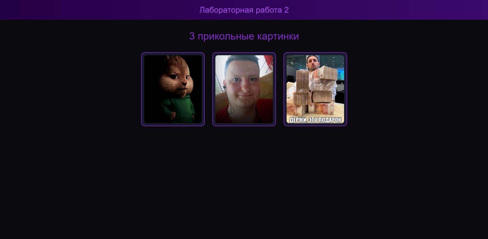

# Лабораторная работа 2. Сборка сайта с помощью node, Vite, SASS, Bootstrap.
## Постановка задачи
1. Изучите материалы, представленные в блоке материалов Сборка сайта с помощью Node, npm, yarn, SASS, vite. 
2. Используя один из подходов (vite / рекомендуется, webpack, nose-sass) приведите пример создания собственного кастомного дизайна сайта (на примере сайта-портфолио) с использованием Bootstrap или Bulma (или другого фреймворка, например, Tailwind).
3. Создайте отчет в виде текстового документа с использованием скриншотов или скринкаста, продемонстрируйте  результаты выполнения.
## Используемые технологии
- node.js
- Vite
- SASS
- Bootstrap
## Ход работы
### Создание проекта
```bash
npm create vite@latest
npm install
```
### Подключение SASS
```bash
npm install sass
```
Также был создан файл styles.scss, в который будут записаны стили.
### Подключение Bootstrap
```bash
npm install bootstrap
```
## Реализация сайта
### index.html
```html
<!DOCTYPE html>
<html lang="ru">

<head>
  <meta charset="UTF-8">
  <title>Лабораторная работа 2</title>
</head>

<body>

  <header class="header">
    <h2>Лабораторная работа 2</h2>
  </header>

  <main class="container text-center">

    <h1 class="title">3 прикольные картинки</h1>

    <div class="memes">

      <div class="meme-card">
        
      </div>

      <div class="meme-card">
        
      </div>

      <div class="meme-card">
        
      </div>

    </div>

  </main>

  <script type="module" src="/src/main.js"></script>
</body>

</html>
```

### styles.scss
```scss
$bg-color: #0a0a0f;
$primary-purple: #7b2cbf;
$light-purple: #9d4edd;
$text-color: #ffffff;

body {
    margin: 0;
    padding: 0;
    background-color: $bg-color;
    color: $text-color;
    font-family: Arial, sans-serif;

    display: flex;
    flex-direction: column;
    align-items: center;
}

.header {
    width: 100%;
    background: linear-gradient(90deg, #240046, #3c096c);
    text-align: center;
    padding: 20px 0;

    h2 {
        margin: 0;
        color: $light-purple;
    }
}

.container {
    max-width: 900px;
    margin-top: 40px;
}

.title {
    margin-bottom: 40px;
    color: $primary-purple;
}

.memes {
    display: flex;
    justify-content: center;
    gap: 30px;
    flex-wrap: wrap;
}

.meme-card {
    background-color: #1a1a2e;
    border: 2px solid $primary-purple;
    border-radius: 15px;
    padding: 10px;
    width: 250px;
    transition: 0.3s;

    &:hover {
        transform: scale(1.05);
        border-color: $light-purple;
    }

    img {
        width: 100%;
        height: 100%;
        border-radius: 10px;
    }
}
```
### main.js
```JavaScript
import 'bootstrap/dist/css/bootstrap.min.css'
import './styles.scss'

console.log('App started')
```
## Результат

## Запуск проекта
```bash
npm run dev
```
## Сборка проекта
```bash
npm run build
```